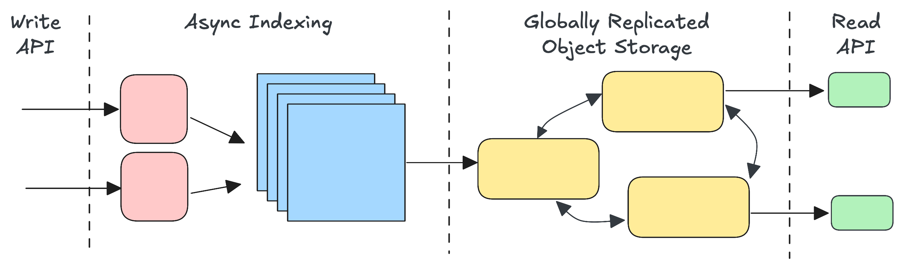

---
{
  title: "Chronicle",
  description: "A global information archive",
}
---

Chronicle is a global information archive. It models information as a set of
immutable records where every record has the same five-part structure. As
information accumulates, Chronicle efficiently organizes it into globally
replicated indexes, enabling low-latency queries from any location.

> Chronicle is **not** a transaction processing system, a requirement for many
> applications. Databases provide transactions, in part, by owning the current
> state of system entities. This leads developers (perhaps unknowingly) to
> accept a fundamental limitation: location-dependent queries that only have
> access to the current state of the database. In practice past states (how a
> database evolved) are relegated to logs, partially added to the current state
> or worse, lost entirely.
