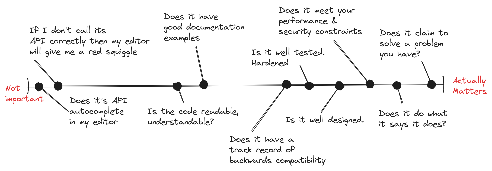

---
{
  title: "People are fired up about types again",
  description: "An open source project decided to move its codebase from typescript to javascript and developers were not happy about it.",
  pub_date: "2023-09-18T23:38:33.561Z"
}
---

The open source project [turbo][turbo] decided to move its codebase from
typescript to javascript and drama ensued. Developers flocked to twitter with
visceral reactions, mock PRs were opened, response videos were made and articles
(like this one) were written.

The change is described in the article
[Turbo 8 is dropping TypeScript][dropping-ts] by DHH. You could argue that it's
not worth writing about this drama anymore. Too bad. I'm channeling the same
energy as the stick figure above... [duty calls](https://xkcd.com/386/).

Let's be clear, I do not want to talk about DHH or his history. I'm pretty sure
that a lot of the online commentary is driven by the desire to dunk on him. I
don't care about that, maybe he deserves it, maybe he doesn't. I do find the
technical arguments people are using to go about their "dunk" very interesting
though.

Minus some embellishment the article is straightforward. TLDR version

- People like typescript. We don't.
- All typescript and type info will be removed in the next version.
- Client code can still use typescript.

## So is this a breaking change?

My mental model for a breaking change is.

1. A user writes code using a library.
2. The user updates to a new version of the library.
3. If the user has to change their code in **any** way for it to continue
   functioning then it's a breaking change.

I like this definition because it's not subjective.

> Pop Quiz! Imagine you updated to a new version of a library and the
> autocomplete in your editor/IDE stopped working. Or if it no longer quickly
> displayed documentation. Is breaking DX a breaking change?

Not knowing what turbo is I had a look at the documentation. Maybe I'm missing
something but the public api seems to only have four methods. In fact as far as
I can tell you're meant to use it by dropping in a script tag with no custom
code at all! Similar to something like [htmx][htmx]. It can't break your
typescript/javascript if you don't have any!

Ok but what if you are calling those API functions? Sure, your tooling will no
longer give you a red squiggle if you mess up the calls, but will it stop
working if all you do is upgrade? I can't see how.

This looks like a non-breaking change... But wait, if we check the published
files they've included all the type definitions. Maybe your code imports those
definitions and now your build is failing. Uh oh, you'd have to change your
codebase to fix it. That's a breaking change!

Yeah yeah, but how many people are actually using turbo like that? Surely the
majority are just making a handful of calls to those API functions... or they're
not using the API at all! Unfortunately you can't wriggle out of breaking
changes like that.

This is a breaking change.

[turbo]: https://github.com/hotwired/turbo
[dropping-ts]: https://world.hey.com/dhh/turbo-8-is-dropping-typescript-70165c01
[dropping-ts-pr]: https://github.com/hotwired/turbo/pull/971
[htmx]: https://htmx.org

## How bad is it?

To recap

1. Does it break existing code that just drops in the script. Nope.
2. Does it break existing code that calls the minimal api without explicitly
   importing types. Nope.
3. Does it break users or wrapping libraries that explicitly import the types.
   Yep.

What percentage of users are impacted? This is really hard to know without
monitoring or telemetry. My gut feeling is that users would overwhelmingly be in
situation 1. or 2.

For those in situation 3. What's required to proceed?

- Stop explicitly using types from the turbo library.
- Maintain the types yourself or contribute to a 3rd party (like
  [React][react-types]).

[react-types]: https://github.com/DefinitelyTyped/DefinitelyTyped/tree/master/types/react

As far as breaking changes go it's not the worst I've seen, not even close. You
could summarize it as - A build time breakage to a minimal API that effects
minority of users. The solution is to maintain what was removed outside the
official project.

> For a bit of perspective let's pivot and consider an alternate situation. Just
> a few weeks ago [Astro 3.0](https://astro.build/blog/astro-3/) dropped,
> alongside an announcement that Vercel will become their official hosting
> partner. At the same time they dropped support for edge rendering in their
> official Vercel adapter. It's a breaking change.
>
> They determined (via telemetry) that it only affected a small number of users.
> The change was justified because it was an internal maintenance burden and a
> solution was to maintain the removed behavior outside the official project.
>
> If you think this is a fair course of action, then it seems like you should at
> least consider the decision made by [turbo][turbo] to be fair as well? No?

I've seen a lot of commentary about how inconsiderate [turbo][turbo] developers
have been to their users with this change, showing a gross lack of empathy. Oh
boy, if you're upset about this I can't wait to hear your python 2/3 takes. Like
it or not breaking changes happen all the time. Sorry, I'm not buying the "think
of the poor users" argument in this case.

## Don't mess with my DX!

If this isn't an egregious breaking change, why the outrage? As developers, we
get way too attached to our tools. We're so concerned about our "editing
experience" it seems we forget about what actually matters to the users of our
software. A lot of dunks focused on DX.

> "to take the first API I can find referenced in the docs — if I start typing
> Turbo.visit(...), I lose:
>
> - checking that `location` is a string | URL
> - autocomplete of e.g. the `action` option (key AND value)
> - inline docs
>
> it's madness." -
> [Rich Harris](https://twitter.com/Rich_Harris/status/1699509930951127088)

> "removing types from your own code is clownish, epically misguided behaviour,
> but whatever — to each their own. Removing types from a library THAT OTHER
> PEOPLE HAVE TO USE, however, is just user-hostile dickwaddery." -
> [Rich Harris](https://twitter.com/Rich_Harris/status/1699490194565578882)

> "Say it with me:
>
> TypeScript was built to make your IDE more powerful.
>
> If you don't use TypeScript, your IDE will do a worse job of helping you.
>
> It's as simple as that." -
> [Matt Pocock](https://twitter.com/mattpocockuk/status/1699541372242436394)

Yep, the worst possible outcome in software development - developers without
autocomplete. This is pure DX bikeshedding! Here is a scale I just completely
made up showing things you might consider when evaluating a library.

I'm not saying DX doesn't matter at all. I'm an autocomplete enjoyer like the
rest of you. I'd also agree that providing type information has become table
stakes in modern frontend development. But really, is it so important that we
need to lob tweets like Molotov cocktails. It might be shocking, but quality
software was written before editors supported autocomplete, language server
protocol, and red squiggly lines. There are more important things (especially
for your users).

## It's 2023! You gotta use them types

Alright here we are, the part of the discussion about types vs no types. I'll
keep it short. Reading through the
[PR](https://github.com/hotwired/turbo/pull/971) it's clear that some people
just couldn't come to terms with the fact maintainers didn't like typescript.
It's kind of comical when you think about people being offended by another
project not using types or a certain tool.

Look I get it, typechecking can help a lot, I use it frequently. But it's just a
tool, with its own set of tradeoffs. It certainly isn't a prerequisite for
writing quality software. There are many, many examples that counter that.

## None of this matters

We're talking about open source software. Everyone is allowed their own
opinions, I certainly have some. However, unless you're a turbo maintainer they
simply don't matter.

> "The only people entitled to say how open source 'ought' to work are people
> who run projects, and the scope of their entitlement extends only to their own
> projects."
>
> "I encourage everyone gnashing their teeth with negativity at what they think
> they can't do instead pick something positive they can do and do it."
>
> [Open source is not about you - Rich Hickey](https://gist.github.com/richhickey/1563cddea1002958f96e7ba9519972d9)
