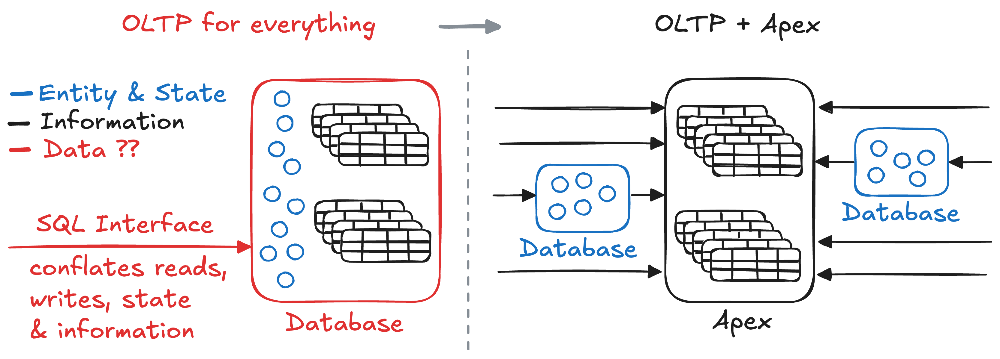

The software we create manipulates data to solve problems. Yet data is too broad
a term - an opaque sequence of ones and zeros. Saying our software deals with
data is really saying very little. So what more can we say?

## Entity, State and Transactions

Our problems often demand solutions that create entities and constrain how their
state evolves given outside input. To achieve this requires varying degrees of
coordination. OLTP databases do exactly that! They provide transactions that let
us atomically transition the state of entities while maintaining invariants
("business rules"). In essence, they're fancy state machines.

Coordination requires observing state and communicating changes - both easier
when co-located. If orchestrating state across distance was easy, it would be
trivial to run all our OLTP systems on the edge. That's not the reality.

> The degree of coordination is problem dependent.   Transactions perform the
> coordination and state evolution.   It's better if everything involved is
> in the same place (locality).

## Information is built different

Information is created the moment the state of any entity is observed. It
contains a reference to the entity, the observed state, and a timestamp.

It's not an entity with evolving state - it's an immutable record that's the
same everywhere, to everyone, whenever they see it. This makes it consistent by
definition, requiring no coordination to replicate, distribute, or cache
forever.

> Information really is nothing like entities that change state. Conflating them
> is a mistake.

## OLTP for everything?

Let's look at some outcomes if we decide to use an OLTP database for all our
"data" requirements.

### Remembering is on you

OLTP is great at orchestrating entities and state but it won't store past states
or how entities change for you. If you're lucky you might be able to completely
solve your problem by only tracking the current state of everything. But more
than likely that's not the case and failing to proactively collect records will
lead to the unpleasant discovery that it's impossible to answer questions about
the past. 😬

The situation becomes worse when the questions about the past aren't even known
when you first build the application. Hoping there's a backup that can answer
your question, or sifting through logs is all accidental record-keeping.

> Forgetting past states isn't really an option for most applications. In those
> cases whether we realize it or not we **must** record information.

### Into the Tar Pit

Okay, so we need records in the database.

Which entities need record-keeping? What if we don't know what historical
questions might be asked? Do we store complete state snapshots or just diffs?
Event sourcing? What's the schema and will it conflict as the rest of the system
evolves? Oh no, migrations become even harder? Wait can a bug accidentally erase
history? 😱 How do we index temporal data? Will queries be more challenging?
What about read performance? Write performance? Storage costs? User experience?

Maybe the biggest red flag: these questions have nothing to do with your actual
problem. They're related to the tool. It's pure accidental complexity.

> When a tool makes simple things complex, it's usually the wrong tool for the
> job.

### Leaving value on the table

The OLTP database has ownership of its entities to provide transactions that
change their state. But immutable records can't change! They are not bound to
the databases transaction scope.

Information is the perfect candidate for being close to where it's needed. We
take something that could be everywhere and constrain it to be somewhere.
Creating artificial scarcity in a landscape of abundant global storage and
content delivery networks.

> We're under-utilizing one of the most distribution-friendly types of data.

## OLAP for everything?

State transitions are either coordinated or they're not. If your problem demands
strict constraints there's no middle ground for "mostly transactional" where
it's fine to break the rules. Lost writes and ambiguous states often manifest as
severe outcomes with unacceptable consequences. Fortunately, we've mostly agreed
this is a bad idea.

Contrast this with using OLTP for information: Some extra complexity for record
keeping and underutilized distribution potential. Those problems seem tolerable
by comparison.

## Release the Records!

The previous sections argue that information and record-keeping don't belong in
OLTP databases. So let's pull them apart! Revert OLTP databases back to what
they do best - transactions and introduce an archive to store and distribute
information to wherever the questions are.

### OLTP restored

So what are the outcomes for OLTP systems when we shift to the diagram on the
right?

#### Fewer entities

Entities representing information disappear entirely. Outside information that's
inserted "because there's nowhere else to put it" can now go straight to the
archive.

What's left? only the entities that require coordinated state transitions. For
applications currently using OLTP for everything, the reduction can be
significant.

#### Less schema

For OLTPs with strong schemas you might be familiar with these

- Temporal fields (`created_at` and `updated_at`)
- History tables (`order_history`, `product_changes`)
- Audit logs (`user_events`)

They're all modelling information. Migrating transactional schema in lock step
with information schema and existing records is no easy task. No one wants
migrations to be **more** complicated. With the archive shift we can just get
rid of all of this. Evolving our software becomes more understandable and less
risky.

#### No more queries

Shouldn't need repeating, but OLTP systems are good at transactions, yet we
often have them doing significant work that has nothing to do with transactions.

When a client observes the state of an entity, the result is information. The
archive distributes information of all entities - it can answer the same
questions.

So let's offload all outside queries to the archive. Yes, that work has been
shifted elsewhere, but for now focus on the OLTP impact: fewer indexes, more
effective caching, more predictable memory usage, less resource competition. Do
more with less.

#### New possibilities

With queries offloaded, we might even choose to look at transactions in a new
light.

- Perhaps a simpler entity/state model like a consistent key-value store meets
  all requirements and delivers better performance.
- Maybe entities have isolated coordination patterns, and it was query concerns
  keeping them together. A partitioned OLTP system could be a better choice:
  microservices that own their database and share the archive.
  - If the isolation patterns are geographic, then solutions like Cloudflare
    Durable Objects might deliver significant throughput and latency
    improvements.

#### Reduced risk

With a shared archive if a database becomes unavailable or is completely lost:

- Reads can still be served from the archive.
- The archive can still accept new records.
- The transaction system can always be restarted from the last known state in
  the archive.
- The role of "backups" shifts to the archive.

One problem with representing records in a system designed for mutable state is
that it's not only possible but easy to change the past. As developers, we write
bugs and make mistakes all the time, so it's almost inevitable that we'll change
things that shouldn't be changed. Backups might help, but what if it goes
unnoticed? An archival system designed for information mitigates this risk.

Overall, OLTP components become low-ceremony parts of the system rather than a
single point of failure that everyone is afraid to touch.

### Unlock the benefits of information

TODO
