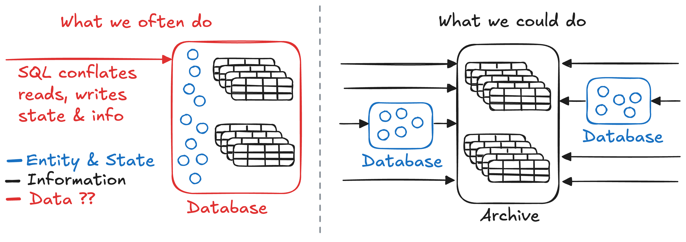

---
{
  title: "Why Apex?",
  description: "The case for a global information archive",
}
---

Software manipulates data to solve problems. Yet data is a general term - an
uninterpreted sequence of ones and zeros. Data solutions, data platforms, data
engineering, data warehouses, even databases - we use "data" everywhere to mean
pretty much anything.

Imprecise marketing is everywhere, but as programmers I'm not so sure we really
understand the characteristics of the "stuff" our systems are built to handle.
And it matters! Real benefits emerge when we're more specific about what we're
using data for and what it actually represents.

## Entity and State

Our problems often demand solutions that create entities and control how their
state evolves based on external requests.

> The classic example is a system that manages bank accounts (entities) where
> users request money transfers. The system should enforce that the state of the
> accounts change correctly or not at all.

This type of coordination challenge is exactly what OLTP databases solve with
**transactions**. They can atomically transition the state of entities according
to specific rules. The "data" in these systems models the state of an entity -
eligible to be changed via a transaction. In essence, they're fancy state
machines.

The degree of coordination varies depending on the problem - the number of
entities involved and the complexity of the rules being enforced. It involves
observing state and communicating changes - both easier when co-located. When
you hear "databases can't run on the edge" this is what's really at play -
coordinating state change is fundamentally at odds with distribution.

The "data" in these systems exhibits certain properties (like anti-distribution)
because of what it represents and how it's used! But not all data represents the
authoritative state of an entity.

## Information is built different

A **record** is created the moment the state of an entity is observed. It
contains a reference to the entity, its state, and a timestamp. Information is
simply a set of records. It's still "data", so why the distinction?

Records are fundamentally different from the entities they describe because they
never change! Records are immutable - the same everywhere, to everyone, whenever
they're read. No coordination is required to view, replicate or distribute them.
Cached records are valid forever.

Recordkeeping and information analysis is often just as important as
transactions in our software - but they're very different things!

## OLTP for everything?

What happens when we use a general-purpose OLTP database to store both state and
information?

### Remembering is on you

OLTP is great at orchestrating entities and state but most won't automatically
store past states or how entities change for you. If you're lucky you might be
able to completely solve your problem by only tracking the current state of
everything. But more than likely that's not the case and failing to proactively
collect records will lead to the unpleasant discovery that it's impossible to
answer questions about the past. 😬

The situation becomes worse when the questions about the past aren't even known
when you first build the application. Hoping there's a backup that can answer
your question, or sifting through logs is all accidental record-keeping.

Forgetting past states isn't really an option for most applications. In those
cases whether we realize it or not we **must** record information.

### Into the Tar Pit

Okay, so we need records in the database.

Which entities need record-keeping? What if we don't know what historical
questions might be asked? Do we store complete state snapshots or diffs to
recreate state? What's the schema and will it conflict as the rest of the system
evolves? Migrations become even harder - oh no. Wait, can a bug accidentally
erase history? 😱 How do we index temporal data? Will queries be more
challenging? What about read performance? Write performance? Storage costs? Will
all this impact user experience?

Maybe the biggest red flag: these questions have nothing to do with your actual
problem. They're related to the tool. It's pure accidental complexity. When a
tool makes simple things complex, it's usually the wrong tool for the job.

### Leaving value on the table

The OLTP database has ownership of its entities, allowing it to run transactions
that can change their state. But immutable records can't change! They are not
bound to a specific location. By storing them in OLTP databases, we're
artificially constraining them to the database's transaction scope.

Information is the perfect candidate for being close to where it's needed. The
world is increasingly connected, storage is abundant and cheap. Yet in this
approach we choose to keep it isolated.

We're under-utilizing one of the most distribution-friendly types of data.

## Release the Records!

The previous sections argue that information and record-keeping don't belong in
OLTP databases. So let's pull them apart!

Keep your existing transaction technology, we don't need to reinvent the wheel
here, just stop burdening them with record-keeping and use them for what they do
best - entitiy, state and transactions.

On the information side I'll make the case for Apex: an archive to store and
distribute records to wherever the questions are.

### OLTP restored

What's the effect on OLTP databases if we shift from the left to the right of
the diagram?

#### Fewer entities

Entities representing information disappear entirely. Outside information that's
inserted "because there's nowhere else to put it" can now go straight to the
archive.

What's left? Only the entities that require managed state transitions. For
applications currently using OLTP for everything, the reduction can be
significant.

#### Less schema

For databases with strong schemas you might be familiar with these:

- Temporal fields (`created_at` and `updated_at`)
- History tables (`order_history`, `product_changes`)
- Audit logs (`user_events`)

They're all modelling information. Migrating transactional schema in lock step
with information schema and existing records is no easy task. Why are we doing
this in the first place?

If you think about schema, it's a constraint that ensures state is valid - part
of the transaction system. But recording "what happened" is always valid! Add it
to the archive and move on.

Schema reverts back to its core purpose - constraining state. There's less of
it, complexity drops, migrations are easier = Better software.

#### No more queries

OLTP systems are good at transactions, yet we often have them doing significant
read-only work that has nothing to do with transactions.

When a client makes a query, for example, "what's the balance of account 123?"
the database observes the state of entities involved before running computations
and returning the result. All queries are just computations over entity states.

However, the archive has records of all entity states - so it can answer the
exact same questions. In fact it can often answer more questions - ones that you
didn't conceive when you first built the application.

When we shift queries to the archive the effect on OLTP is: everything aligns
toward one goal - processing transactions efficiently.

#### New possibilities

With queries offloaded, we might even choose to look at transactions in a new
light.

- Perhaps a simpler entity/state model like a consistent key-value store meets
  all requirements and delivers better performance.
- Maybe entities have isolated coordination patterns, and it was query concerns
  keeping them together. A partitioned OLTP system could be a better choice:
  microservices that own their database and share the archive.
- If the isolation patterns are geographic, then solutions like Cloudflare
  Durable Objects might deliver significant improvements.

#### Reduced risk

With a shared archive if a database becomes unavailable or is completely lost:

- Reads can still be served from the archive.
- The archive can still accept new records.
- The transaction system can always be restarted from the last known state in
  the archive.
- The role of "backups" shifts to the archive.

Another issue with storing records in a system designed for mutable state is
that it's not only possible but easy to change the past. As developers, we write
bugs all the time, We'll inevitably change things that shouldn't be changed.
Backups might help, but what if it goes unnoticed? An archival system designed
for information mitigates this risk.

Overall, OLTP components become low-ceremony parts of the system rather than a
single point of failure that everyone is afraid to touch.

### Apex: Information unlocked

<!--
With all state coordination taken care of, we can shift our focus to an archive
that best leverages the immutable nature of information.

Apex is my take on an information archive. Below is a discussion about what we
should realistically hope to provide with an Apex implementation

#### Extreme durability

A defining characteristic of an archive is keeping records safe. They should be
enduring, pristine and free from tampering. If the archive delivers on
durability, OLTP backups become the less reliable option.

Let's replace scattered, point-in-time backups with a unified archive that
preserves everything.

#### High Availability

Having rich information isn't much use if it's not available when you need it.
Since immutable records require no coordination to replicate, high availability
should be achievable without the usual tradeoffs.

So let's do that - build something users can count on to answer their questions.

#### Fast Answers Everywhere

If you haven't caught on yet, information has this wonderful property that it's
the same everywhere. The constraints of storage are essentially gone, so we
absolutely should store it everywhere! The outcome is global low-latency
queries. Imagine just querying a CDN instead of the database. It's possible!

> Our vast global network spanning 330 cities is one of the fastest on the
> planet. In fact, we can reach about 95% of the world’s population within
> approximately 50 ms. - [Cloudflare](https://www.cloudflare.com/security/)

Why stop there? Immutable records can be cached directly in our applications,
directly on user devices - some queries could be effectively instant perhaps
even offline! What's more, all queries are independent, they don't affect any
other queries or transactions in any way.

If you use an OLTP database for everything you're leaving all this value on the
table. Anyone that believes "the edge" is incompatible with our "data" systems
is missing out!

#### A proper basis

Content addressing gives every set of information a unique, verifiable hash.
Sharing the hash conveys the entire set of records - a true immutable basis. Any
computed results or analysis become completely reproducible by anyone with the
hash.

Where this matters: A user reports a bug, but you've got no way to reproduce it
because the state of the database has evolved. A proper basis solves that.

#### Other constraints

- We gain leverage over information by comparing records so let's provide all
  the records sorted (indexed).
- Scalable writes. If there's a lot of information we need to be able to ingest
  it all in a reasonable amount of time globally.

---

If you're excited about any of this or have questions, get in touch!
-->
