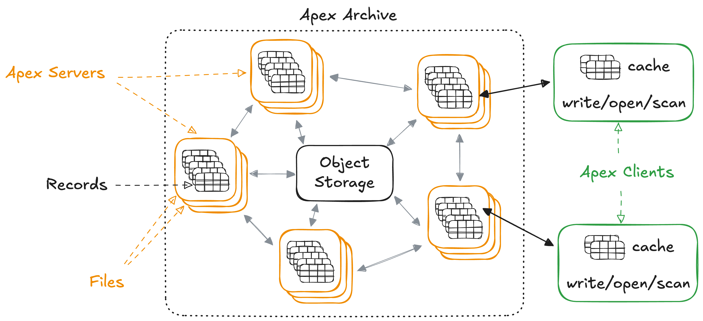

---
{
  title: "Why Apex?",
  description: "The case for a global information archive",
}
---

Software manipulates data to solve problems. Yet data is a general term - an
uninterpreted sequence of ones and zeros. Data solutions, data platforms, data
engineering, data warehouses, even databases - we use "data" everywhere to mean
pretty much anything.

Imprecise marketing is everywhere, but as programmers I'm not so sure we really
understand the characteristics of the "stuff" our systems are built to handle.
And it matters! Real benefits emerge when we're more specific about what we're
using data for and what it actually represents.

## Entity and State

Our problems often demand solutions that create entities and control how their
state evolves based on external requests.

> The classic example is a system that manages bank accounts (entities) where
> users request money transfers. The system should enforce that the state of the
> accounts change correctly or not at all.

This type of coordination challenge is exactly what OLTP databases solve with
**transactions**. They can atomically transition the state of entities according
to specific rules. The "data" in these systems models the state of an entity -
eligible to be changed via a transaction. They're essentially sophisticated
state machines.

The degree of coordination varies depending on the problem - the number of
entities involved and the complexity of the rules being enforced. It involves
observing state and communicating changes - both easier when co-located. When
you hear "databases can't run on the edge" this is what's really at play -
coordinating state change is fundamentally at odds with distribution.

The "data" in these systems exhibits certain properties (like anti-distribution)
because of what it represents and how it's used! But not all data represents the
authoritative state of an entity.

## Information is built different

A **record** is created the moment the state of an entity is observed. It
contains a reference to the entity, its state, and a timestamp. Information is
simply a set of records. It's still "data", so why the distinction?

Records are fundamentally different from the entities they describe because they
never change. Records are immutable - the same everywhere, to everyone, whenever
they're read. No coordination is required to view, replicate or distribute them.
Cached records are valid forever.

Recordkeeping and information analysis is often just as important as
transactions in our software, but they're very different things!

## OLTP for everything?

What happens when we use a general-purpose OLTP database to store both state and
information?

### Remembering is on you

OLTP is great at orchestrating entities and state but most won't automatically
store past states or how entities change for you. If you're lucky you might be
able to completely solve your problem by only tracking the current state of
everything. But more than likely that's not the case and failing to proactively
collect records will lead to the unpleasant discovery that it's impossible to
answer questions about the past. 😬

The situation becomes worse when the questions about the past aren't even known
when you first build the application. Hoping there's a backup that can answer
your question, or sifting through logs is all accidental record-keeping.

Forgetting past states isn't really an option for most applications. In those
cases whether we realize it or not we **must** record information.

### Into the Tar Pit

Okay, so we need records in the database.

Which entities need record-keeping? What if we don't know what historical
questions might be asked? Do we store complete state snapshots or diffs to
recreate state? What's the schema and will it conflict as the rest of the system
evolves? Migrations become even harder - oh no. Wait, can a bug accidentally
erase history? 😱 How do we index temporal data? Will queries be more
challenging? What about read performance? Write performance? Storage costs? Will
all this impact user experience?

Maybe the biggest red flag: these questions have nothing to do with your actual
problem. They're related to the tool. It's pure accidental complexity. When a
tool makes simple things overly complex, it's usually the wrong tool for the
job.

### Leaving value on the table

The OLTP database has ownership of its entities, allowing it to run transactions
that can change their state. But immutable records can't change! They are not
bound to a specific location. By storing them in OLTP databases, we're
artificially constraining them to the database's transaction scope.

Information is the perfect candidate for being close to where it's needed. The
world is increasingly connected, storage is abundant and cheap. Yet in this
approach we choose to keep it isolated.

We're under-utilizing one of the most distribution-friendly types of data.

## Release the Records!

The previous sections argue that information and record-keeping don't belong in
OLTP databases. So let's pull them apart!


Keep your existing transaction technology, we don't need to reinvent the wheel
here, just stop burdening them with record-keeping and use them for what they do
best - entity, state and transactions.

On the information side I'll make the case for Apex: an archive to store and
distribute records to wherever the questions are.

### OLTP restored

What's the effect on OLTP databases if we shift from the left to the right of
the diagram?

#### Fewer entities

Entities representing information disappear entirely. Outside information that's
inserted "because there's nowhere else to put it" can now go straight to the
archive.

What's left? Only the entities that require managed state transitions. For
applications currently using OLTP for everything, the reduction can be
significant.

#### Less schema

For databases with strong schemas you might be familiar with these:

- Temporal fields (`created_at` and `updated_at`)
- History tables (`order_history`, `product_changes`)
- Audit logs (`user_events`)

They're all modelling information. Migrating transactional schema in lock step
with information schema and existing records is no easy task. Why are we doing
this in the first place?

If you think about schema, it's a constraint that ensures state is valid - part
of the transaction system. But recording "what happened" is always valid! Add it
to the archive and move on.

Schema reverts back to its core purpose - constraining state. There's less of
it, complexity drops, migrations are easier = Better software.

#### No more queries

OLTP systems are good at transactions, yet we often have them doing significant
read-only work that has nothing to do with transactions.

When a client makes a query, for example, "what's the balance of account 123?"
the database observes the state of entities involved before running computations
and returning the result. All queries are just computations over entity states.

However, the archive has records of all entity states - so it can answer the
exact same questions. In fact it can often answer more questions - ones that you
didn't conceive when you first built the application.

When we shift queries to the archive the effect on OLTP is: everything aligns
toward one goal - processing transactions efficiently.

#### New possibilities

With queries offloaded, we might even choose to look at transactions in a new
light.

- Perhaps a simpler entity/state model like a consistent key-value store meets
  all requirements and delivers better performance.
- Maybe entities have isolated coordination patterns, and it was query concerns
  keeping them together. A partitioned OLTP system could be a better choice:
  microservices that own their database and share the archive.
- If the isolation patterns are geographic, then solutions like Cloudflare
  Durable Objects might deliver significant improvements.

#### Reduced risk

With a shared archive if a database becomes unavailable or is completely lost:

- Reads can still be served from the archive.
- The archive can still accept new records.
- The transaction system can always be restarted from the last known state in
  the archive.
- The role of "backups" shifts to the archive.

Another issue with storing records in a system designed for mutable state is
that it's not only possible but easy to change the past. As developers, we write
bugs all the time. We'll inevitably change things that shouldn't be changed.
Backups might help, but what if it goes unnoticed? An archival system designed
for information mitigates this risk.

Overall, OLTP components become low-ceremony parts of the system rather than a
single point of failure that everyone is afraid to touch.

### Apex: Information unlocked

Imagine an old school archive - a filing cabinet. You can locate a **file** by
name and **open** it. Inside you'll find a **sorted set** of records that you
can **scan** through. You can also **write** new records to a file.

#### API Example

Let's write two records to a file named `"foo"` in the archive. Records are
treated as raw binary data.

```js
write("foo", [0b1011, 0b11]);
```

If the write succeeds then the records are durable. Next we can open the file
and see what's in it. The result is always an immutable sorted set of records
that we can scan through.

```js
s1 = open("foo");
scan(s1); // [0b1011, 0b11]
```

Let's write some more records.

```js
write("foo", [0b11, 0b11011, 0b010]);
s2 = open("foo");
scan(s1); // [0b1011, 0b11] - hasn't changed
scan(s2); // [0b010, 0b1011, 0b11, 0b11011] - has the new records
```

#### Write Anywhere, Read Everywhere

Earlier we argued that records should be close to where they're needed, where
the questions are. Here's what that looks like:



Apex clients can write new records to files in the archive. Apex servers will
accept the records, persist them to object storage and communicate with the
other servers. Eventually, the files for all servers will converge on the set of
all written records.

It's important to emphasize that files are the **only** part of the archive that
actually changes - they grow. Whenever a client opens a file they might get a
different set of records, one with more information than last time they looked.
Each set and the records they contain are all 100% immutable. They provide a
proper basis for reproducible analysis.

## What's next?

Apex is intentionally minimal - it sorts and distributes binary records. The
goal is to provide a foundation for information systems. But there's a lot left
unanswered.

**What happens when Apex goes down? Am I now maintaining two systems that can
both fail?**

Apex is designed like a CDN. Each apex server runs identical code and is able to
serve requests from any client independently. They can run multi-zone,
multi-region and even multi-cloud.

Why is it common to use CDNs for websites? That's also an extra system that
could fail. The reason is that CDNs specialize in a specific task (content
delivery), handling it more reliably and efficiently than origin servers alone.
Apex is designed to have the same effect on OLTP databases.

Consider the inverse scenario: what happens when the OLTP database goes down or
becomes unavailable? With Apex, your information stays accessible even when
transactions go offline.

**What about backups?**

All records reside in S3-like object storage. With this level of durability
(eleven 9s), Apex replaces your existing database backups!

**What read/write latencies can I expect globally?**

The write latency is the time for records to become durable. It requires
acknowledgement from object storage and other servers. The design target is
under `500ms` globally. Write throughput is high and scales with the number of
servers.

Propagation lag is the time for a new record to be included in the file for all
servers. The design target is under `20s` globally.

Read latencies are extremely low due to aggressive multi-level caching. The read
path starts directly at the client, then the server before falling back to
object storage.

**Isn't eventual consistency a nightmare for business-critical data?**

Eventually consistent "data" might trigger an immediate negative reaction, and
rightly so, it's a bad idea for coordinating state. But that's not what's going
on here, distributed processes receive information at different times, you can't
sidestep the speed of light.

Even if clients query a strongly consistent database, the results are records
from the past! The information clients have can only ever be eventually
consistent with the source (database). The physics of information sharing _is_
eventual consistency - it's the correct choice for Apex.

**How does a user immediately see their own changes if Apex has a 20-second
propagation delay?**

This concern is largely contrived. First, the 20-second figure represents global
propagation - a situation a single client would rarely encounter. Local
propagation happens within seconds.

Second, the ability to "read your own writes" is not incompatible with an
eventually consistent archive. Apex clients can handle it.

1. If a client writes directly to the archive, it can simply construct a set
   that includes the new records.
2. If a client performs a transaction, the system can also return a set that
   includes all records up to and including the transaction result.

Finally, if the time it takes the archive to converge is unacceptable, just send
the correct basis (set of records) directly.

**How do applications actually model and query their information using just
sorted binary records?**

It's all up to the Apex client! The archive provides the foundation to allow
client libraries to create information formats, query-engines, OLTP connectors,
AI integrations etc.

Apex doesn't exist yet, nor do these client libraries - but that's the point. 
The case here is for the right foundation to enable it to happen.

<!--

**Why binary records? Why no format, schema or query language? How do
applications actually use this in practice?**

The short answer is: an Apex client library.

The archive deals with binary records because that's all it needs, everything
else can happen at the client level. Implementors can experiment with different
query-engines, information schemas, AI etc, and not be stuck with what the
database provides.

**How do you delete data when everything is designed to be permanent and
distributed everywhere?**

Sometimes systems have to forget. User requests, court order, GDPR compliance,
etc. It's possible with apex but not straightforward. This is by design, you
don't want to accidentally forget valuable information. The approach is to
construct a new file with the problematic records filtered out. At which point
the previous file can be completely erased.

**Most systems aren't globally distributed. Why do I need this if I'm just
running a typical app?**

Globally distributing information is a bonus. Apex servers don't _have_ to be
distributed. They can run in a single region if data sovereignty is a concern.

However, this article puts forward two other issues with using an OLTP database
for everything.

1. Remembering is on you. A database with an integrated Apex client can keep
   records automatically from the start - even ones you might not know you need
   yet.
2. Into the tar pit. Recordkeeping in most transactional databases comes with a
   lot of incidental complexity. It starts small but as software evolves it
   rapidly becomes a big concern. Apex can fix this.

**Why wouldn't I just use Kafka or Snowflake with CDC?**

Does solution `X`:

- replace operational queries served by user facing databases?
- retain transactional constructs like schema?
- naturally distribute information globally like a CDN?
- give access to pre-sorted records or require re-indexing locally or on the
  fly?

There's a lot of great OLAP technology out there and if they suit your system,
great! That being said there's always room for more ideas.

**Why sort the records? Are records stored redundantly for every index?**

The records are sorted in storage because it means all the clients don't have to
repeat the work - they get query-ready information directly.

Apex just sorts binary records lexicographically, to sort records differently
you have to encode the record accordingly and write to a separate file. So yes,
redundant storage, but storage is cheap.

As for the number of indexes it's up to the apex clients to decide how to model
information and the number of indexes required.

**Is this just event sourcing? CQRS?**

**This is interesting, how can I try it?**

Apex is just a concept at the moment, pure vapourware. I'm working on it. If
you're interested get in touch!

#### TODO

- better explanation around "read your own writes" improve the 20s delay i think
  the reader will be unconvinced.
- answers are too hand wavey: client handles this. I need to make that more
  obvious

  -->
